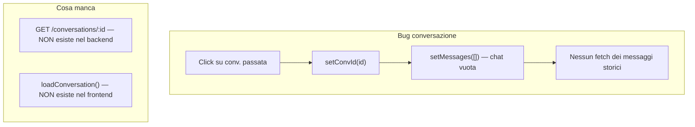
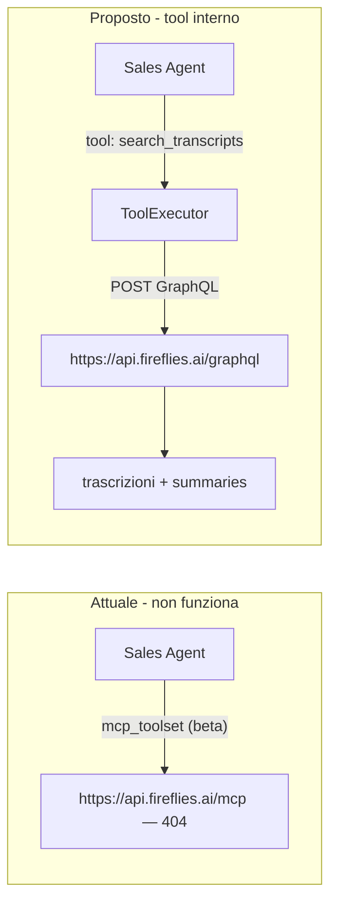
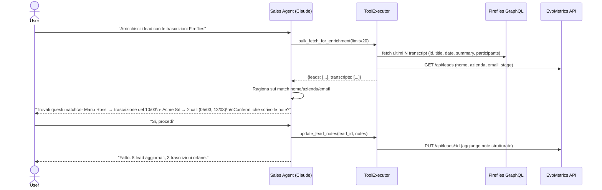
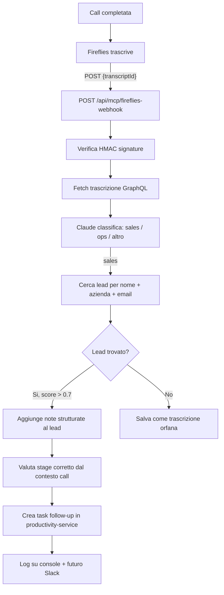

# EvoAgent: Conversazioni + Fireflies Intelligence

## Stato attuale e diagnosi




---

## Fix 1 — Bug conversazioni passate

**Backend** — `[backend/services/mcp-service/main.py](backend/services/mcp-service/main.py)`

Aggiungere endpoint:

```python
@app.get("/api/mcp/evo-agent/conversations/{conv_id}")
async def get_evo_agent_conversation(conv_id: str, request: Request, db: Session = Depends(get_db)):
    conversation = db.query(AgentConversation).filter(
        AgentConversation.id == conv_id,
        AgentConversation.user_id == user["id"]
    ).first()
    return {
        "id": conversation.id,
        "title": conversation.title,
        "messages": conversation.messages or [],
        "agent_id": ...,  # da messages[-1].agent_id se presente
        "updated_at": conversation.updated_at.isoformat(),
    }
```

**Frontend** — `[frontend-react/src/pages/EvoAgentPage.tsx](frontend-react/src/pages/EvoAgentPage.tsx)`

Sostituire l'onClick delle conversazioni (attualmente solo `setConvId + setMessages([])`):

```typescript
const openConversation = async (id: string) => {
  setConvId(id);
  setMessages([{ id: 'loading', role: 'assistant', content: '', isLoading: true }]);
  const data = await apiFetch(`/api/mcp/evo-agent/conversations/${id}`);
  // Mappa messages: {role, content} → Message[]
  setMessages(data.messages.map((m, i) => ({ id: `h${i}`, role: m.role, content: m.content })));
  if (data.agent_id) setActiveAgent(data.agent_id);
};
```

---

## Fix 2 — Memoria cross-conversazione (contesto persistente)

Attualmente il modello legge solo i messaggi della conversazione corrente. Il campo `agent_id` non viene salvato per messaggio nel DB.

- Aggiungere `agent_id` alla struttura messaggi salvati: `{role, content, agent_id, ts}`
- Il system prompt già include data/ora e utente — nessun cambio necessario
- Limite 50 messaggi per conversazione già implementato: ok

---

## Fix 3 — Fireflies: da MCP remoto a tool interno REST

Il server MCP `https://api.fireflies.ai/mcp` **non esiste** (confermato: connection reset). Fireflies espone solo una **GraphQL API** su `https://api.fireflies.ai/graphql`.




**In `[backend/services/mcp-service/evo_agent.py](backend/services/mcp-service/evo_agent.py)`:**

Rimuovere `_AGENT_MCP_SERVERS` Fireflies e aggiungere 3 tool interni al `ToolExecutor`:

```python
# Tool 1: cerca trascrizioni per nome/azienda
async def search_fireflies_transcripts(self, query: str, limit: int = 5) -> str:
    # POST https://api.fireflies.ai/graphql con Authorization: Bearer FIREFLIES_API_KEY
    # Query GraphQL: transcripts(filter: {title: query}) → id, title, date, summary, sentences

# Tool 2: dettaglio trascrizione
async def get_fireflies_transcript(self, transcript_id: str) -> str:
    # Restituisce summary + action_items + key_topics

# Tool 3: match lead → trascrizione
async def match_lead_to_transcripts(self, lead_id: str) -> str:
    # Prende nome/azienda/email del lead da /api/leads
    # Cerca in Fireflies per nome + azienda
    # Restituisce le trascrizioni correlate con score di match
```

Aggiungere i tool alle definizioni `SALES_TOOLS` e `CLIENTS_TOOLS`.

---

## Fix 3b — Bulk enrichment: arricchimento storico lead da Fireflies

Per il backlog di trascrizioni esistenti, si aggiunge un quarto tool che aggrega tutto e lascia a Claude il matching.

**Flusso conversazionale:**



**Quarto tool da aggiungere al `ToolExecutor`:**

```python
async def bulk_fetch_for_enrichment(self, limit: int = 20) -> str:
    # Fetcha in parallelo:
    # - ultimi N transcript da Fireflies (id, title, date, summary, participants[])
    # - tutti i lead da /api/leads (id, nome, cognome, azienda, email)
    # Restituisce JSON compatto con entrambi i set
    # Claude usa questo output per ragionare sul matching
```

**Limitazione rate limit Anthropic:** il tool restituisce max 20 trascrizioni + lead correlati per turno. Per pipeline più grandi, l'utente può chiedere "processa i successivi 20".

---

## Fix 4 — Webhook Fireflies: automazione proattiva

**Come funziona:** Fireflies invia una POST al nostro server non appena una trascrizione è pronta. Il payload contiene `transcriptId`. Da lì fetchtiamo i dettagli via GraphQL e processiamo automaticamente.

**Setup richiesto (una tantum):**

- In Fireflies → Settings → Webhooks → aggiungere `https://[render-url]/api/mcp/fireflies-webhook`
- Aggiungere `FIREFLIES_WEBHOOK_SECRET` nelle env var (stringa segreta per verificare le richieste)
- Funziona solo in produzione (Render) — in locale non è raggiungibile da Fireflies




Le note aggiunte al lead hanno questa struttura fissa:

```
[AUTO - Fireflies 2026-03-15]
Tipo call: Discovery / Demo / Follow-up
Durata: 32 min
Partecipanti: Mario Rossi (cliente), Paolo (AE)
Sintesi: [summary Fireflies]
Action items: [...lista]
Sentiment: positivo / neutro / negativo
```

**Nuovo endpoint** in `[backend/services/mcp-service/main.py](backend/services/mcp-service/main.py)`:

```python
@app.post("/api/mcp/fireflies-webhook")
async def fireflies_webhook(request: Request, background_tasks: BackgroundTasks):
    # 1. Verifica HMAC signature con FIREFLIES_WEBHOOK_SECRET
    # 2. Estrae transcriptId dal payload
    # 3. In background: fetch GraphQL → classifica → match lead → update notes + task
    return {"status": "accepted"}  # risponde subito 200, processo in background
```

Il processing avviene in `BackgroundTasks` per non tenere Fireflies in attesa (evita retry del webhook).

---

## File coinvolti

- `[backend/services/mcp-service/main.py](backend/services/mcp-service/main.py)` — Fix 1 (endpoint conv), Fix 4 (webhook)
- `[backend/services/mcp-service/evo_agent.py](backend/services/mcp-service/evo_agent.py)` — Fix 3 (tool interni Fireflies, rimozione MCP remoto)
- `[frontend-react/src/pages/EvoAgentPage.tsx](frontend-react/src/pages/EvoAgentPage.tsx)` — Fix 1 (openConversation), Fix 2 (agent_id nel messaggio)

